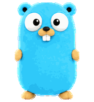
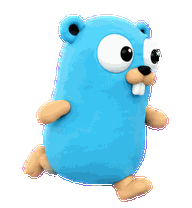
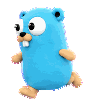
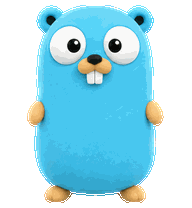
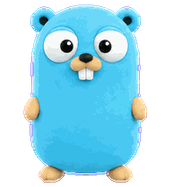
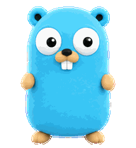
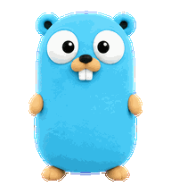
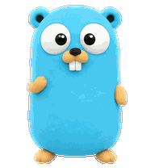

# Gopher for Codex

A plush cyan Go gopher with animated actions and 16 look directions for Codex.

<table>
  <tr>
    <td align="center"><br>Idle</td>
    <td align="center"><br>Run right</td>
    <td align="center"><br>Run left</td>
    <td align="center"><br>Wave</td>
    <td align="center"><br>Jump</td>
    <td align="center"><br>Failed</td>
    <td align="center"><br>Wait</td>
    <td align="center"><br>Working</td>
    <td align="center"><br>Review</td>
  </tr>
</table>

## Install with npm

Requires Node.js and npm. Works on macOS, Linux, and Windows:

```sh
npx --yes github:gwakuh/codex-gopher-pet
```

## Install from the terminal

On macOS or Linux, clone the repository into the Codex pet directory:

```sh
mkdir -p "${CODEX_HOME:-$HOME/.codex}/pets" && git clone --depth 1 https://github.com/gwakuh/codex-gopher-pet.git "${CODEX_HOME:-$HOME/.codex}/pets/gopher"
```

Both methods place `pet.json` and `spritesheet.webp` under `~/.codex/pets/gopher` by default. Set `CODEX_HOME` if Codex uses another home directory. On Windows, the default path is `%USERPROFILE%\.codex\pets\gopher\`.

Restart Codex, then select **Gopher** in Settings → Pets. To update, rerun the npm command or run `git -C "${CODEX_HOME:-$HOME/.codex}/pets/gopher" pull` after cloning.

To remove it, delete the `gopher` folder from your Codex `pets` directory.
