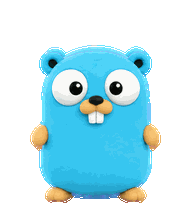

# Codex Gopher Pet

A plush cyan Go gopher pet for Codex, packaged as an animated v2 sprite sheet.



## Install

Requires Codex desktop with custom pets enabled. Run:

```sh
mkdir -p ~/.codex/pets && git clone --depth 1 https://github.com/gwakuh/codex-gopher-pet.git ~/.codex/pets/gopher
```

Restart or refresh Codex, then select **Gopher** in the pet settings.

To remove it:

```sh
rm -r ~/.codex/pets/gopher
```

On Windows, copy `pet.json` and `spritesheet.webp` into `%USERPROFILE%\.codex\pets\gopher\`.
